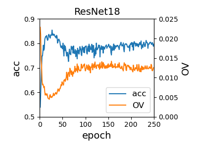

# Optimization Variance: Exploring Generalization Properties of DNNs

This repository is the official implementation of **Optimization Variance: Exploring Generalization Properties of DNNs**

## Requirements

pytorch = 1.5.1
tensorboardX

## Training

To train the model in the paper, run this command:

```train
python train.py data_name model_name noise_split opt lr test_id data_root
# data_name: 'svhn', 'cifar10', 'cifar100'
# model_name: 'vgg11', 'vgg13', 'vgg16', 'resnet18', 'resnet34'
# noise_split: [0, 1)
# opt: 'adam', 'sgd'
# lr: learning rate
# test_id: 0, marker
# data_root: direction of datasets
```

## Plot Optimization Variance and Acc

see log_to_csv.py and plot_var_acc.py

## Results

OV and ACC:


## Contributing

If you'd like to contribute, or have any suggestions for these guidelines, you can contact us at xiao_zhang@hust.edu.cn or open an issue on this GitHub repository.
All contributions welcome! All content in this repository is licensed under the MIT license.